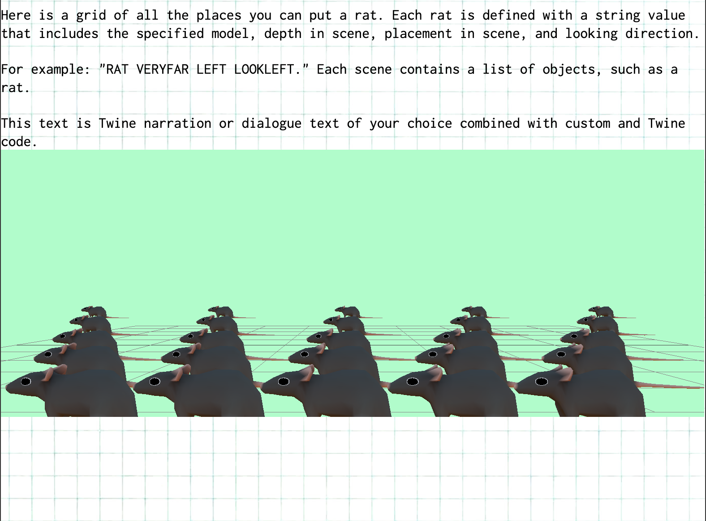
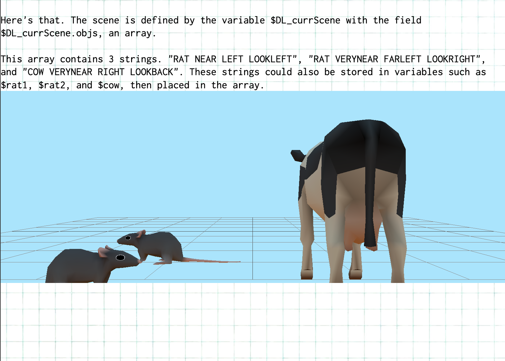
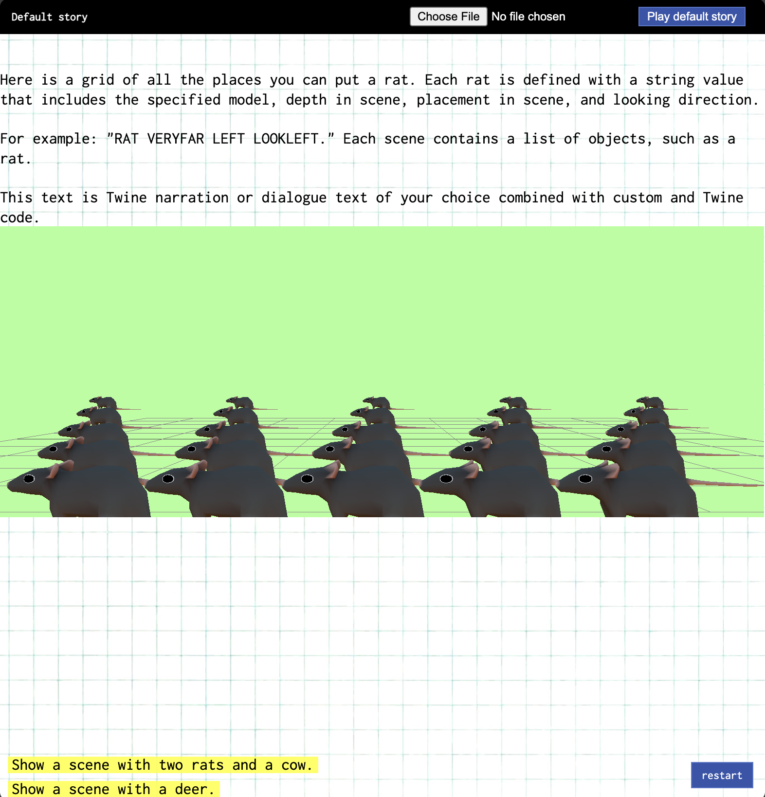
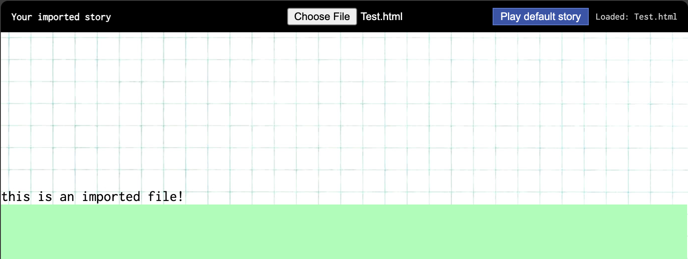

This project began because I wanted to make a storytelling tool for artists. I like comics, I like interactive media, I like games and funky little clickable tools, but I’m not very good at making games. I like picking through the capabilities of tools people give me and see how funnily I can make them spin. By making a tool *I* can use, that my friends and I can use, I’m shortcutting the “What do I use to tell my story” step that I always deliberate on.

When I was given access to Twine and told to make a very basic story, I read through a good deal of the Twine Harlowe (default story format) documentation and made a silly randomized project that looped on itself, rather than attempting to tell a good story. Y/N, equipped with a handy pocket-burger, climbs through an eternal construction site and talks to a randomized NPC at every level. The “game” ends when you’ve completed seven loops and have picked up a screw from the ground at every level. I was chuffed at the fact I could code a parametrized “narrative” game like that.

That’s not to say I don’t like to make good stories. When I’m not working my ass off in my CS cores, I’m usually creating original characters who have wacky stories of their own and live in wide, ironic, contradictory literary worlds that I illustrate. I just often struggle to find a suitable way to Tell these stories. Can I really draw unique cutscenes for every character? Draw every background for a visual novel?...

There's something I really love about Twine, and that's how powerful it is, while having an extremely simple base UI. Fully text based stories. So let's start simple: my concept is to make a tool for users to create interactive webcomics.

1. I decided to just *use* Twine for narrative/dialogue flow. I want to keep the variables, scripting, conditional logic, etc, of Twine. 
2. Then, I'll have the user be able to define simple parametrized scenes for each node within their Twine stories. Since I want to go 3D, I'll use THREE.js for this.
3. From there, there are tons of additional features to be parametrized so that an author can control how their stories look. More scene elements. Animation. UI. You name it.

## STEP 1
### Making Twine work for me

So now, I have code that reads from a headless Sugarcube-compiled .html file as a logic engine, and a p5js file that is sent passages. A click onto this p5js canvas simulates a click into the hidden Sugarcube iframe. It’s clean, it’s stupid, it works.

The next step is making something that actually looks nice. I wanted users of my tool to be able to import 3D models + bgs + objects with preset poses that they could procedurally tell, within some Twine code, how to pose and frame themselves within a comic panel. How do I incorporate both 3D and 2D graphics at all? three.js!

My current template generates a random cube + bg color just as a proof of concept (per panel). When you revisit a panel, it shows the same object as before.

Next, after importing some very simple placeholder 3d models and objects and scenes, I will be integrating scene composition based on variables users set in Twine. I already can access variables as soon as they are updated per node.

## STEP 2
### Set the scene

While I would love for rigged models to be imported into scenes, then placed in neat environments with total control over lighting and camera and whatnot, I decided to scale down my prototype into something simple for a user to control.

I'll be using David OReilly's everything models for now. [Animals](https://davidoreilly.itch.io/everything-library-animals)! They make great, lowpoly building blocks for simple to complex iconographic stories.

Given just a few common animals and my positioning syntax, I imagine users will be still able to tell a wide variety of fable-like stories, along with whatever they may want to tell. For now, I hope this limitation allows users to have fun and be creative without being too nitpicky about what is shown onscreen.

### STEP 2.5
Publishing to the web and an interface overhaul!

This next step is about how I want to present my tool to the user. After some research and consultation from Codex, it turns out I can't compile Twine's .twee native files into Sugarcube HTML files in the browser, because [Tweego](https://www.motoslave.net/tweego/) is a CLI. This just means that the user has to import an already compiled .html file from the app, which is just an additional step. 

Nonetheless, I added a UI bar at the top of Dialomic for users to import their own .html stories to run instead of my default tutorialish file!

Finally, I published the file on Github pages here: https://alextangnt.github.io/dialomic/

## NEXT STEPS

* Get some speech bubbles in there! Handle overlap and layering logic! Figure out who's saying what.
* Import some background presets to use.
* Procedural animation in panels?