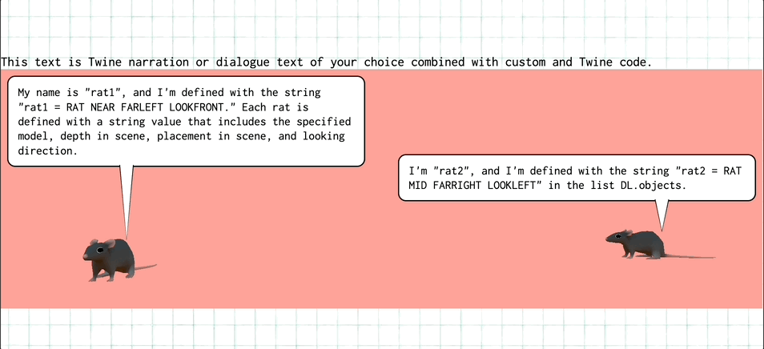
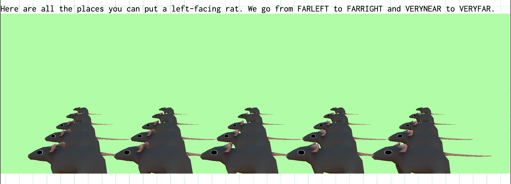

**Dialomic**
Dialomic turns Twine stories into interactive webcomics with animated 3D panels, narration overlays, and speech bubbles. Authors write standard SugarCube passages and add a few formatting conventions so scenes and dialogue can be parsed automatically.

**Core SugarCube Concepts**
- SugarCube stores story state in `State.variables` (exposed as `$var` in Twine).
- Use `<<set $var = ...>>` to define scene variables.
- Use `[[link text|Passage Name]]` to create choices (SugarCube creates `.link-internal` anchors).

References:
- Twine: https://twinery.org/
- SugarCube documentation: https://www.motoslave.net/sugarcube/2/
- SugarCube macro reference: https://www.motoslave.net/sugarcube/2/docs/

**Passage Formatting**
- Paragraphs are split on blank lines (or `<br><br>` after export), meaning each individual paragraph will be parsed for "speaker" or "narration".
- Everything after `%%%` is ignored by the scene/narration parser (use this to separate narrative from choices if desired).

Example passage block:
```twine
<<set $DL = {
  objs: [
    "rat1= RAT VERYNEAR FARLEFT LOOKFRONT",
    "rat2= RAT MID FARRIGHT LOOKFRONT",
    "RAT NEAR CENTER LOOKLEFT"
  ],
  background: "bus stop"
}>>

rat1:: This is a speaker line that will become a speech bubble.

This is narration (plain passage text).
%%%
[[Choice A|Some Passage]]
[[Choice B|Other Passage]]
```

**Speaker Syntax (Speech Bubbles)**
- To mark a paragraph as spoken dialogue, start the paragraph with `speakerKey::`.
- The `speakerKey` must match a scene object key (see Object Keys below).
- Multiple speaker paragraphs are supported. Each speaker paragraph becomes its own bubble.
- Narration is all non‑speaker paragraphs.

Example:
```twine
rat1:: Hello.
rat2:: Hi.

This is narration.
```

**Choices / Links**
- Any SugarCube `[[link]]` becomes a choice button in the UI.
- The UI uses the link’s HTML as the label (so you can include formatting in the link text).

Example:
```twine
[[Show a deer.|Now add a deer.]]
```

**Scene Variables (3D Models)**
Your scene should be stored in `State.variables.DL` (i.e., `$DL` in Twine).

Minimum shape:
```twine
<<set $DL = { objs: ["RAT NEAR CENTER LOOKLEFT"] }>>
```

Supported `objs` formats:
- Array of strings.
- Object map keyed by object id.

**Object Keys (For Speaker Matching)**
If you want `speakerKey::` to target a model, the key must exist in `DL.objects`.

Option A (recommended): object map keyed by id
```twine
<<set $DL.objects = {
  rat1: "RAT VERYNEAR FARLEFT LOOKFRONT",
  rat2: "RAT MID FARRIGHT LOOKLEFT"
}>>
```

Option B: array with `key=SPEC` strings
```twine
<<set $DL.objects = [
  "rat1= RAT VERYNEAR FARLEFT LOOKFRONT",
  "rat2= RAT MID FARRIGHT LOOKLEFT"
]>>
```

With this text underneath:
```
rat1:: My name is "rat1", and I'm defined with the string "rat1 = RAT NEAR FARLEFT LOOKFRONT." Each rat is defined with a string value that includes the specified model, depth in scene, placement in scene, and looking direction.
rat2:: I'm "rat2", and I'm defined with the string "rat2 = RAT MID FARRIGHT LOOKLEFT" in the list DL.objects.

This text is Twine narration or dialogue text of your choice combined with custom and Twine code.
```

Both of the above formats produce this result.




**Object Spec String Format**
Each object string follows:
```
MODEL DISTANCE LOCATION FACING
```

Accepted tokens:
- Distance: `VERYNEAR`, `NEAR`, `MID`, `FAR`, `VERYFAR`
- Location: `FARLEFT`, `LEFT`, `CENTER`, `RIGHT`, `FARRIGHT`
- Facing: `LOOKLEFT`, `LOOKFRONT`, `LOOKRIGHT`, `LOOKBACK`



**Accepted Model Tokens (Animals)**
Use the model name as the first token. These map to `.glb` files in `public/animals/`. As of now, authors have access to:
- `RAT`
- `CAT`
- `COW`
- `DEER`
- `ELEPHANT`
- `HARE`
- `WOLF`

If you add new models to `public/animals/`, just use the filename (case insensitive) as the token.

**Background Models**
Set a background with:
```twine
<<set $DL.background = "bus stop">>
```
This loads:
```
public/background/bus_stop.glb
```
Slug rules:
- Lowercase
- Spaces and punctuation become `_`

Defaults are applied for position/scale unless you extend the code.

**Twine Variables and Custom State**
You can define reusable object specs as variables and reference them in `DL.objects`.

Example:
```twine
<<set $rat1 = "RAT VERYNEAR FARLEFT LOOKFRONT">>
<<set $rat2 = "RAT MID FARRIGHT LOOKFRONT">>
<<set $DL.objects = [$rat1, $rat2]>>
```

**Narration vs Speech Bubble Rendering**
- Speaker paragraphs (matched with `speakerKey::`) render as speech bubbles.
- All other paragraphs render as narration above the panel.
- Multiple speaker paragraphs produce multiple bubbles.

**Common Pitfalls**
- If a background fails to load, check the filename and slugging (`"bus stop"` -> `bus_stop.glb`).
- If a speaker bubble doesn’t appear, the `speakerKey` likely doesn’t match a scene object key.
- Anything after `%%%` is ignored for narration parsing.

**How It Works (Behind The Scenes)**
- The runtime listens to SugarCube’s `:passageend` event (see `public/messaging.js`).
- `public/messaging.js` captures passage HTML and `.link-internal` anchors, then posts them to the app.
- `src/layout.js` parses passage HTML and SugarCube variables (`State.variables`).
- `src/panel.js` builds the 3D scene, speech bubbles, and narration UI.